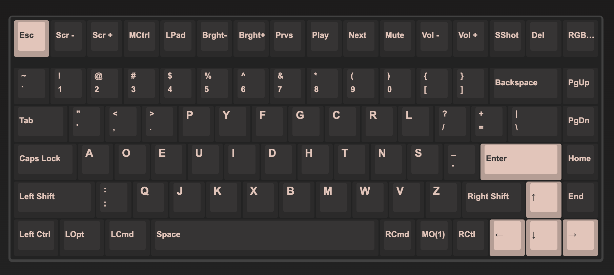

# VIA Keymaps for Keychron K3 Pro

This repo contains a simple JSON file which will set the keymaps of your Keychron keyboard to [DVORAK](https://en.wikipedia.org/wiki/Dvorak_keyboard_layout) layout.

## How to use

1. Start your VIA app (or go to [the web app](https://usevia.app/#/))
1. Go to 'Design' tab
1. (or to 'Settings' tab to enable 'Designs')
1. Load the JSON (be sure to enable V2 definitions)
1. View the layout in 'Configure'
1. Ready to go!
